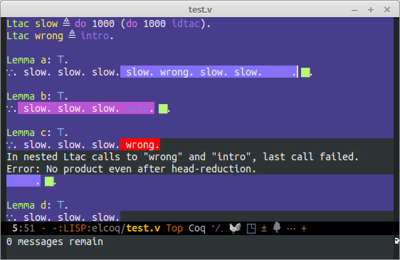

=================
 SerAPI in Emacs
=================

This is an experimental prototype using @ejgallego's SerAPI in Emacs.  Useful as an experimentation platform, with hope of merging parts of this into Proof General.

Video demo: https://asciinema.org/a/b84ph360841x3c9lwq6pyihm9

Setting up
==========

- Clone the repo recursively::

    git clone cpitclaudel/elcoq --recursive

- Compile Coq and SerTOP (in the ``serapi`` directory) according to
  `Emilio's instructions <https://github.com/ejgallego/coq-serapi#building>`_.

- Install ``elcoq``\'s dependencies (either using ``cask install`` or using ``M-x package-install dash``).

- Add the following to your .emacs::

  (setq elcoq-coq-directory "/path/to/root/of/coq/sources/")

Using it
========

- Open ``elcoq.el`` in Emacs; run ``M-x eval-buffer``

- Open the ``test.v`` file.

- Use ``M-x elcoq-run`` to start SerTOP (you can also use this to reset it to a clean state).

- Go to the end and use ``M-x coq-queue-up-to`` to add sentences.

- Use ``M-x elcoq--sertop-observe`` to start asynchronous processing.
